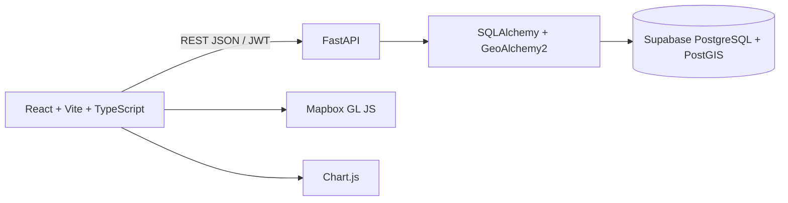

# Darukaa.Earth

Darukaa.Earth is a geospatial restoration monitoring platform for mapping environmental project sites and reviewing their performance over time.

## Features

- JWT registration, login, protected routes, and logout
- User-owned projects and PostGIS-backed polygon sites
- GeoJSON polygon input/output with server-side ownership enforcement
- Mapbox dashboard and project maps
- Mapbox Draw workflow for creating site boundaries
- Site analytics for carbon, biodiversity, and canopy cover
- Chart.js time-series visualizations
- Synthetic 12-month demo records clearly labelled as demonstration data

## Architecture



The application preserves the required architecture:

`React -> FastAPI -> SQLAlchemy + GeoAlchemy2 -> PostgreSQL/PostGIS`

## Database schema

- `users`: authenticated application users
- `projects`: user-owned restoration workspaces
- `sites`: project-owned `POLYGON` geometry in SRID 4326
- `analytics_records`: one monthly record per site/date, with carbon, biodiversity, and canopy cover values

Relationships are `User -> Projects -> Sites -> Analytics records`. Project and site access is filtered server-side by the authenticated owner.

## API overview

Base path: `/api/v1`

- `POST /auth/register`
- `POST /auth/login`
- `GET /auth/me`
- `GET|POST /projects`
- `GET|PUT|DELETE /projects/{id}`
- `GET|POST /projects/{project_id}/sites`
- `GET|DELETE /sites/{id}`
- `GET|POST /sites/{id}/analytics`

## Local setup

### Requirements

- Python 3.11+
- Node.js 20+
- A Supabase PostgreSQL database with PostGIS enabled
- A Mapbox public access token

### Backend

```powershell
cd backend
..\.venv\Scripts\python.exe -m pip install -r requirements.txt
Copy-Item .env.example .env
```

Set `DATABASE_URL` in `backend/.env` to the Supabase PostgreSQL URL. The application accepts `postgresql://...` and automatically selects the psycopg SQLAlchemy driver.

Run the migration:

```powershell
..\.venv\Scripts\alembic.exe upgrade head
```

Start the API:

```powershell
..\.venv\Scripts\uvicorn.exe app.main:app --reload --port 8000
```

Optional demo data:

```powershell
..\.venv\Scripts\python.exe seed.py
```

The demo account is `demo@darukaa.earth` with password `DarukaaDemo123!`. Change or remove this account before production use.

### Frontend

```powershell
cd frontend
npm install
Copy-Item .env.example .env
```

Set:

- `VITE_API_URL`, normally `http://localhost:8000/api/v1`
- `VITE_MAPBOX_TOKEN`, a Mapbox public token with the required map access

Start the frontend:

```powershell
npm run dev
```

## Supabase/PostGIS setup

Create or select a Supabase project with PostGIS available. Use its direct database connection string as `DATABASE_URL`. The first Alembic migration runs `CREATE EXTENSION IF NOT EXISTS postgis` and creates the geometry column. Do not use SQLite: spatial functionality depends on PostGIS.

## Testing and quality

Backend:

```powershell
cd backend
..\.venv\Scripts\ruff.exe check app tests
..\.venv\Scripts\black.exe --check app tests
..\.venv\Scripts\python.exe -m pytest tests -q
```

Frontend:

```powershell
cd frontend
npm run lint
npm run typecheck
npm run build
```

Husky and lint-staged run frontend ESLint and Prettier checks for staged TypeScript files. The repository pre-commit configuration runs Ruff and Black for backend files.

## CI/CD

`.github/workflows/ci-cd.yml` runs backend migrations, tests, Ruff, and Black, then frontend linting, typechecking, and production build. On pushes to `main`, it can deploy the frontend to Vercel and trigger the Render backend deploy hook.

Configure these GitHub secrets:

- `VERCEL_TOKEN`
- `VERCEL_ORG_ID`
- `VERCEL_PROJECT_ID`
- `RENDER_DEPLOY_HOOK_URL`

Production environment variables must be configured separately in Vercel and Render. Never commit `.env` files or credentials.

## Deployment

- Frontend: deploy `frontend` to Vercel with `VITE_API_URL` and `VITE_MAPBOX_TOKEN`.
- Backend: deploy the `backend` service to Render with `DATABASE_URL`, `SECRET_KEY`, `ALGORITHM`, `ACCESS_TOKEN_EXPIRE_MINUTES`, and `CORS_ORIGINS` configured.
- Database: Supabase PostgreSQL + PostGIS.

The Render service should run:

```text
uvicorn app.main:app --host 0.0.0.0 --port $PORT
```

## Synthetic data and trade-offs

The seeded analytics values are realistic synthetic demonstration values, not scientifically validated environmental measurements. This keeps the challenge self-contained while making the time-series experience evaluable. The backend keeps analytics intentionally simple: one record per site and date, with three indicators and no unrequired ingestion pipeline.

The frontend uses a compact REST client and Zustand auth store rather than a larger data-fetching framework. Mapbox is only initialized when a public token is configured, which keeps local auth and API development possible without hiding missing map credentials.

## Known limitations

- The application does not ingest live satellite or sensor feeds.
- Polygon drawing requires a valid Mapbox public token.
- Analytics are demonstration data unless records are entered through the API.
- Production deployment still requires the operator's Vercel, Render, Supabase, and Mapbox credentials.
